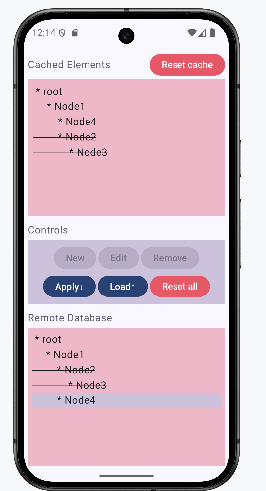

# Tree Database App 🌳
## Main requirement
implement syncronization through this interface:
```kotlin
interface TreeDatabaseApi {
  suspend fun fetchNode(id: String): NodeData?
  suspend fun apply(nodes: List<NodeData>)
}```

## 📱 Technologies
- Kotlin
- Jetpack Compose
- Dagger/Hilt
- Room
- Clean Architecture + MVVM
- Flow, Kotlin Coroutines

## Main components


## Screenshot
